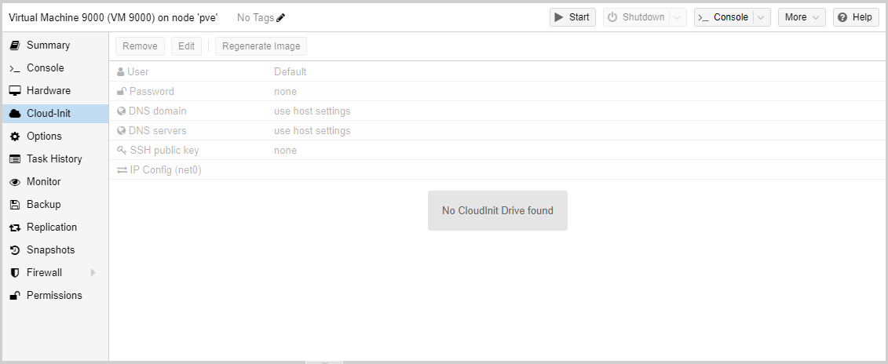
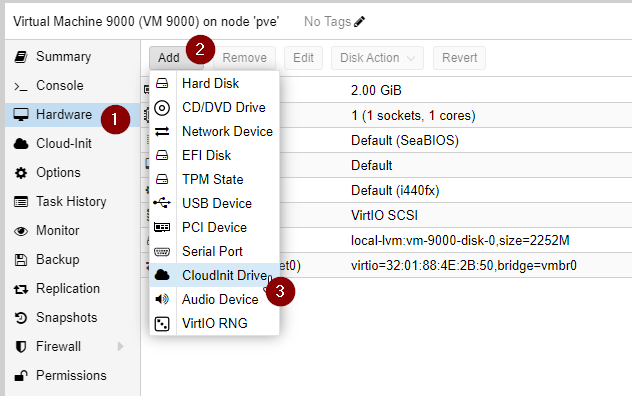
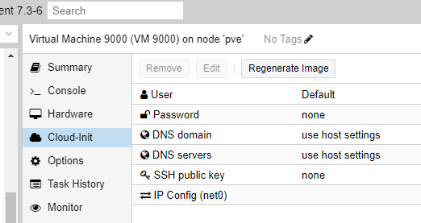

## Cloud-init образы в Proxmox

Ниже представлен в своей редакции примерный перевод двух статей из wiki proxmox: [Cloud-Init FAQ](https://pve.proxmox.com/wiki/Cloud-Init_FAQ) и [Cloud-Init Support](https://pve.proxmox.com/wiki/Cloud-Init_Support)

### Что такое cloud-init?

Cloud-init — это, по сути, программа, которая запускается на гостевой машине при загрузке и ищет данные конфигурации для применения к гостевой системе во время инициализации.

Идея состоит в том, чтобы иметь определенный независимый от ОС формат конфигурации для параметров, общих для многих систем (таких как имя хоста и сетевая конфигурация). На практике это не всегда работает очень хорошо, поэтому есть несколько странностей и проблем, о которых вам следует знать, поскольку мы не будем добавлять обходные пути, специфичные для ОС и облачной версии, поскольку это разрушило бы весь смысл этой системы.

Подробные примеры командной строки [см. на странице поддержки Cloud-Init в справочной документации.](#подробная-инструкция-cloud-init)

### Использование в Proxmox VE

В Proxmox VE образы cloud-init подключаются как образы ISO через виртуальный привод CDROM. Чтобы начать использовать вкладку cloud-init в веб-интерфейсе, вам необходимо добавить такой диск. 



Это можно сделать на вкладке `Hardware`, нажав кнопку `Add` и выбрав `CloudInit Drive`. После этого становятся доступными параметры на вкладке `cloud-init`.



#### Параметры



**User**

Облачные образы часто настраиваются для установки пароля пользователя и/или ключей ssh. Обычно это делается для пользователя по умолчанию, который часто называют в честь работающего дистрибутива. Эта опция может быть использована для изменения настроек пользователя. С помощью этого следует создать пользователя с указанным именем и применить настройки пароля и ключа ssh.

**Password**

Вариант пароля должен быть простым. Однако обратите внимание, что до версии cloud-init 17.1 поддерживались только пароли в виде открытого текста. Наш API по умолчанию предварительно хэширует пароли, отправляемые в виде открытого текста, поэтому, чтобы установить пароль на старых облачных образах, пароли в открытом виде необходимо вручную записать в конфигурацию виртуальной машины в файле `/etc/pve/qemu-server/${vmid}.conf`

**SSH public key**

Это может быть один или несколько открытых ключей SSH для настроенного выше пользователя. Однако при загрузке их из файла обратите внимание, что Proxmox VE в настоящее время не принимает строки комментариев.

**DNS domain и DNS servers**

Они работают аналогично своим контейнерным аналогам, и аналогичным образом несколько DNS-серверов могут быть указаны в виде списка, разделенного пробелами.

**IP Config (ethX)**

Как и в случае с контейнерами, здесь будет настроен IP-адрес гостя. Для каждого сетевого интерфейса должна быть одна такая запись. Обратите внимание, что способ передачи конфигурации сети гостю может сильно различаться в зависимости от того, какой тип образа cloud-init используется. Это можно изменить с помощью опции `citype`. См. ниже.

**citype (только интерфейс командной строки)**

В настоящее время Proxmox VE поддерживает два типа образов cloud-init: nocloud v1 (по умолчанию и рекомендуемый тип) и configdrive v2. Большинство образов из основных дистрибутивов должны нормально работать со значениями по умолчанию. В будущем также может поддерживаться nocloud v2, который должен предложить более надежный способ настройки сетевых устройств, поскольку он не зависит от конкретных имен устройств (см. раздел [Сеть](#сеть) ниже).

Вариант configdrive v2 может работать для гостей Windows, использующих cloudbase-init, но официально он не поддерживается.

### Особенности и требования к cloud init образам.

В идеале облачный образ должен работать под управлением последней версии cloud-init, по крайней мере, 18.2 или новее. Есть несколько проблем со старыми версиями, упомянутыми ниже.

##### Сеть

По устаревшим причинам имена сетевых устройств облачных образов должны использовать «старые» имена сетевых устройств: (eth0, eth1, ...). Это связано с тем, что старые форматы конфигурации cloud-init совершали ту же ошибку, что и все остальные, сопоставляя интерфейсы по имени без другого варианта. Более новые версии cloud-init поддерживают конфигурации, подобные netplan, где вы можете сопоставить MAC-адрес или драйвер, но они не широко доступны в текущих образах cloud-init. (На момент написания это поддерживал только образ `ubuntu bionic`).

Новый формат конфигурации nocloud v2 будет поддерживаться в будущем, когда это требование будет снято.

Обратите внимание, что (на момент написания) версия cloud-init, поставляемая с образами Centos 7, не может обрабатывать нотацию CIDR для адресов IPv4, которую мы используем в нашей версии выпуска Proxmox VE 5.2.

##### Имя хоста

До версии cloud-init 18.2 имя хоста не устанавливалось перед запросами DHCP, что означает, что в этот момент используется имя хоста образа по умолчанию, что приводит к конфликтам имен хостов.

### Создание пользовательского облачного образа

#### Шаг 1: Установите базовую систему

Это может быть любая система, для которой вы можете установить работающий пакет cloud-init. Обратите внимание, что если вы создаете этот образ самостоятельно, было бы неплохо попытаться установить более новую версию cloud-init, чем та, которую вы найдете в различных репозиториях основного дистрибутива.

#### Шаг 2: Подготовка системы

**Переименовать сетевые устройства**

Для лучшей совместимости, особенно при использовании более старых версий cloud-init, вам нужно настроить правила udev / systemd-networkd конфигурацию / связи файлов в etc, чтобы вернуться от предсказуемых имен устройств к именам ядра (eth0 и т. д.). См. главу [«Предсказуемые имена сетевых интерфейсов»](https://www.freedesktop.org/wiki/Software/systemd/PredictableNetworkInterfaceNames/) на сайте freedesktop.org.

**Добавить пользователя по умолчанию**

Обычно при использовании cloud-init вы входите в систему с предопределенным пользователем, отличным от root, хотя это необязательно. Имя пользователя может быть настроено в пакете cloud-init и переопределено параметрами конфигурации cloud-init Proxmox VE.

**Установить стандартные пакеты**

Поскольку вы обычно не будете входить в систему как пользователь root и получать предварительно настроенные настройки пользователя, вам нужно установить sudo, чтобы иметь возможность выполнять административные задачи позже. Помимо установки пароля пользователя, вы также можете предоставить ssh-ключи, развернутые cloud-init при загрузке, поэтому, скорее всего, вы также захотите настроить ssh-сервер и выполнить на нем некоторую первоначальную настройку (например, выбор альтернативного порта, отключение root-доступа, ограничивающие шифры и др.)

**Настройка последовательного терминала**

Многие облачные образы предполагают наличие последовательной линии. Сообщения ядра и запрос на регистрацию часто настраиваются для ttyS0. Если вы собираетесь загружаться с grub, вы можете использовать следующую конфигурацию:

```bash
# /etc/default/grub
(...)
GRUB_CMDLINE_LINUX_DEFAULT="console=tty1 console=ttyS0"
(...)
```

После изменения этого вам придется воссоздать конфигурацию grub (например, update-grub). В качестве альтернативы вы можете соответствующим образом настроить свой inittab, если он у вас есть, или запустить эквивалент `systemctl enable getty@ttyS0.service`.

**Очистить изображение**

После настройки пользователя и sudo по умолчанию вы можете удалить пароль root (и любые другие, которые вы не хотите включать в шаблон), чтобы не иметь какой-либо пароль root по умолчанию в шаблоне, развернутом в разных местах.

#### Шаг 3. Установите и настройте cloud-init.

После того, как все будет готово, последним шагом будет установка и настройка пакета cloud-init. (`apt install cloud-init`, `yum install cloud-init` и тд.).

**Настроить источники данных**

Proxmox VE в настоящее время поддерживает источники данных nocloud-v1 и configdrive-v2. Если вы используете шаблон только с Proxmox VE, вы можете использовать следующий фрагмент конфигурации в качестве оптимизации времени загрузки:

```bash
# /etc/cloud/cloud.cfg.d/99_pve.cfg
datasource_list: [ NoCloud, ConfigDrive ]
```

**Установить имя пользователя по умолчанию**

Пользователь по умолчанию обычно находится в разделе `system_info` файла `/etc/cloud/cloud.cfg` в разделе `default_user`. Вы можете изменить свойство `name`. Дистрибутивы часто используют имя дистрибутива в нижнем регистре в качестве имени пользователя по умолчанию. Например. в Ubuntu вы найдете следующий раздел:

```bash
# /etc/cloud/cloud.cfg
(...)
system_info:
    default_user:
        name: ubuntu
(...)
```

Здесь вы можете добавить различные дополнительные параметры (например, какую строку следует добавить в файл sudoers). Для получения более подробной информации см. вышестоящую документацию по cloud-init.

### Поиск неисправностей

Как только ваш шаблон будет готов, вы захотите протестировать его. Если вы решили очистить данные для входа, а настройка пользователя по какой-то причине не работает, возможно, вы только что создали систему, в которую не можете войти. Вы можете использовать все обычные способы отладки, но вот несколько полезных напоминаний:
* Для дистрибутива на основе systemd вы можете использовать режим «редактирования» grub, чтобы добавить `systemd.debug-shell=1` в командную строку ядра, что даст вам корневую оболочку на `Ctrl+Alt+F9` на ранней стадии.
* Присоединение живого образа к виртуальной машине позволяет вам войти в нее и прочитать системные журналы / журнал предыдущих попыток загрузки (`journalctl -b-1`).
* Поскольку cloud-init часто настраивается для отключения входа в систему root, перед настройкой cloud-init можно добавить временного пользователя отладки с доступом sudo, которого вы можете удалить или отключить позже.

---

### Подробная инструкция Cloud-init

[Cloud-Init](https://canonical-cloud-init.readthedocs-hosted.com/en/latest/) — это пакет де-факто с несколькими дистрибутивами, который обрабатывает раннюю инициализацию экземпляра виртуальной машины. С помощью Cloud-Init возможна настройка сетевых устройств и ssh-ключей на стороне гипервизора. Когда виртуальная машина запускается в первый раз, программное обеспечение Cloud-Init внутри виртуальной машины применяет эти настройки.

Многие дистрибутивы Linux предоставляют готовые к использованию образы Cloud-Init, в основном предназначенные для OpenStack. Эти образы также будут работать с Proxmox VE. Хотя может показаться удобным получить такие готовые к использованию изображения, мы обычно рекомендуем подготовить изображения самостоятельно. Преимущество в том, что вы будете точно знать, что у вас установлено, и это поможет вам в дальнейшем легко настроить образ под свои нужды.

После того, как вы создали такой образ Cloud-Init, мы рекомендуем преобразовать его в шаблон виртуальной машины. Из шаблона виртуальной машины вы можете быстро создавать связанные клоны, так что это быстрый способ развертывания новых экземпляров виртуальной машины. Вам просто нужно настроить сеть (и, возможно, ключи ssh) перед запуском новой виртуальной машины.

Мы рекомендуем использовать аутентификацию на основе ключа SSH для входа на виртуальные машины, подготовленные Cloud-Init. Также можно установить пароль, но это не так безопасно, как использование аутентификации на основе ключей SSH, потому что Proxmox VE необходимо хранить зашифрованную версию этого пароля внутри данных Cloud-Init.

Proxmox VE создает образ ISO для передачи данных Cloud-Init на виртуальную машину. Для этого всем виртуальным машинам Cloud-Init должен быть назначен привод CD-ROM. Обычно следует добавить последовательную консоль и использовать ее в качестве дисплея. Многие образы Cloud-Init полагаются на это, это требование для OpenStack. Однако другие образы могут иметь проблемы с этой конфигурацией. Вернитесь к конфигурации дисплея по умолчанию, если использование последовательной консоли не работает.

### Подготовка шаблона Cloud-init

Первый шаг — подготовить вашу виртуальную машину. В принципе, вы можете использовать любую виртуальную машину. Просто установите пакеты Cloud-Init внутри виртуальной машины, которую вы хотите подготовить. В системах на основе Debian/Ubuntu это так же просто, как:

```bash
apt-get install cloud-init
```

!!! Эта команда не предназначена для выполнения на хосте Proxmox VE, а только внутри виртуальной машины.

Многие дистрибутивы уже предоставляют готовые к использованию образы Cloud-Init (предоставленные в виде файлов .qcow2), поэтому в качестве альтернативы вы можете просто загрузить и импортировать такие образы. В следующем примере мы будем использовать облачный образ, предоставленный Ubuntu по адресу https://cloud-images.ubuntu.com.

```bash
# download the image
wget https://cloud-images.ubuntu.com/bionic/current/bionic-server-cloudimg-amd64.img

# create a new VM with VirtIO SCSI controller
qm create 9000 --memory 2048 --net0 virtio,bridge=vmbr0 --scsihw virtio-scsi-pci

# import the downloaded disk to the local-lvm storage, attaching it as a SCSI drive
qm set 9000 --scsi0 local-lvm:0,import-from=/path/to/bionic-server-cloudimg-amd64.img
```

!!! Для образов Ubuntu Cloud-Init требуется тип контроллера virtio-scsi-pci для дисков SCSI.

Добавьте дисковод компакт-дисков Cloud-Init.

Следующим шагом является настройка привода CD-ROM, который будет использоваться для передачи данных Cloud-Init на виртуальную машину.

```bash
qm set 9000 --ide2 local-lvm:cloudinit
```

Чтобы иметь возможность загружаться непосредственно с образа Cloud-Init, установите для параметра загрузки значение order=scsi0, чтобы ограничить загрузку BIOS только с этого диска. Это ускорит загрузку, поскольку VM BIOS пропускает тестирование загрузочного компакт-диска.

```bash
qm set 9000 --boot order=scsi0
```

Для многих образов Cloud-Init требуется настроить последовательную консоль и использовать ее в качестве дисплея. Однако, если конфигурация не работает для данного изображения, вместо этого вернитесь к отображению по умолчанию.

```bash
qm set 9000 --serial0 socket --vga serial0
```

На последнем этапе полезно преобразовать виртуальную машину в шаблон. Из этого шаблона вы можете быстро создавать связанные клоны. Развертывание из шаблонов ВМ происходит намного быстрее, чем создание полного клона (копии).

```bash
qm template 9000
```

### Развертывание шаблонов Cloud-Init

Вы можете легко развернуть такой шаблон, клонировав:

```bash
qm clone 9000 123 --name ubuntu2
```

Затем настройте открытый ключ SSH, используемый для аутентификации, и настройте настройку IP:

```bash
qm set 123 --sshkey ~/.ssh/id_rsa.pub
qm set 123 --ipconfig0 ip=10.0.10.123/24,gw=10.0.10.1
```

Вы также можете настроить все параметры Cloud-Init, используя только одну команду. Мы просто разделили приведенный выше пример, чтобы разделить команды для уменьшения длины строки. Также не забудьте принять настройку IP для вашей конкретной среды.

### Пользовательская конфигурация Cloud-Init

Интеграция Cloud-Init также позволяет использовать пользовательские файлы конфигурации вместо автоматически сгенерированных конфигураций. Это делается с помощью параметра cicustom в командной строке:

```bash
qm set 9000 --cicustom "user=<volume>,network=<volume>,meta=<volume>"
```

Пользовательские файлы конфигурации должны находиться в хранилище, которое поддерживает фрагменты, и должны быть доступны на всех узлах, на которые будет перенесена виртуальная машина. В противном случае виртуальная машина не сможет запуститься. Например:

```bash
qm set 9000 --cicustom "user=local:snippets/userconfig.yaml"
```

Для Cloud-Init существует три вида конфигураций. Первый — это конфигурация пользователя, как показано в примере выше. Второй — сетевая конфигурация, а третий — метаконфигурация. Все они могут быть указаны вместе или смешаны и сопоставлены по мере необходимости. Автоматически сгенерированная конфигурация будет использоваться для всех, для которых не указан пользовательский файл конфигурации.

Сгенерированный конфиг можно дампить, чтобы он служил основой для пользовательских конфигов:

```bash
qm cloudinit dump 9000 user
```

Одна и та же команда существует для сети и мета.

### Специальные параметры Cloud-Init

- **`cicustom: [meta=<volume>] [,network=<volume>] [,user=<volume>] [,vendor=<volume>]`**
    Укажите пользовательские файлы для замены автоматически сгенерированных при запуске.
    - `meta=<volume>`
        Укажите пользовательский файл, содержащий все метаданные, переданные на виртуальную машину через '.' облачная инициализация. Это зависит от конкретного провайдера, что означает, что configdrive2 и nocloud различаются.
    - `network=<volume>`
        Укажите пользовательский файл, содержащий все сетевые данные, передаваемые на виртуальную машину через cloud-init.
    - `user=<volume>`
        Укажите пользовательский файл, содержащий все пользовательские данные, переданные на виртуальную машину через cloud-init.
    - `vendor=<volume>`
        Укажите пользовательский файл, содержащий все данные поставщика, переданные на виртуальную машину через cloud-init.

- **`cipassword: <string>`**
    Пароль для назначения пользователю. Использование этого обычно не рекомендуется. Вместо этого используйте ключи ssh. Также обратите внимание, что старые версии cloud-init не поддерживают хешированные пароли.

- **`citype: <configdrive2 | nocloud | opennebula>`**
    Задает формат конфигурации cloud-init. Значение по умолчанию зависит от настроенного типа операционной системы (ostype. Мы используем формат nocloud для Linux и configdrive2 для Windows.

- **`ciuser: <string>`**
    Имя пользователя, для которого нужно изменить ключи ssh и пароль вместо настроенного пользователя образа по умолчанию.

- **`ipconfig[n]: [gw=<GatewayIPv4>] [,gw6=<GatewayIPv6>] [,ip=<IPv4Format/CIDR>] [,ip6=<IPv6Format/CIDR>]`**
    Укажите IP-адреса и шлюзы для соответствующего интерфейса.
    IP-адреса используют нотацию CIDR, шлюзы необязательны, но требуют указания IP того же типа.
    Специальная строка dhcp может использоваться для IP-адресов для использования DHCP, и в этом случае не нужно указывать явный шлюз. Для IPv6 можно использовать специальную строку auto, чтобы использовать автоконфигурацию без сохранения состояния. Для этого требуется cloud-init 19.4 или новее.
    Если включена функция cloud-init и не указаны ни IPv4, ни IPv6-адреса, по умолчанию используется DHCP на IPv4.
    - `gw=<GatewayIPv4>`
        Шлюз по умолчанию для трафика IPv4.
            Требуемый вариант(ы): ip
    - `gw6=<GatewayIPv6>`
        Шлюз по умолчанию для трафика IPv6.
            Требуемый вариант(ы): ip6
    - `ip=<IPv4Format/CIDR> (default = dhcp)`
        IPv4-адрес в формате CIDR.
    - `ip6=<IPv6Format/CIDR> (default = dhcp)`
        IPv6-адрес в формате CIDR.

- **`nameserver: <string>`**
    Задает IP-адрес DNS-сервера для контейнера. Create автоматически использует настройку с хоста, если ни searchdomain, ни nameserver не установлены.

- **`searchdomain: <string>`**
    Задает домены поиска DNS для контейнера. Create автоматически использует настройку с хоста, если ни searchdomain, ни nameserver не установлены.

- **`sshkeys: <string>`**
    Настройте открытые ключи SSH (один ключ на строку, формат OpenSSH).

---

##### Полезные ссылки:

* https://pve.proxmox.com/wiki/Cloud-Init_Support

* https://pve.proxmox.com/wiki/Cloud-Init_FAQ

* https://pve.proxmox.com/wiki/Qemu/KVM_Virtual_Machines

* https://canonical-cloud-init.readthedocs-hosted.com/en/latest/